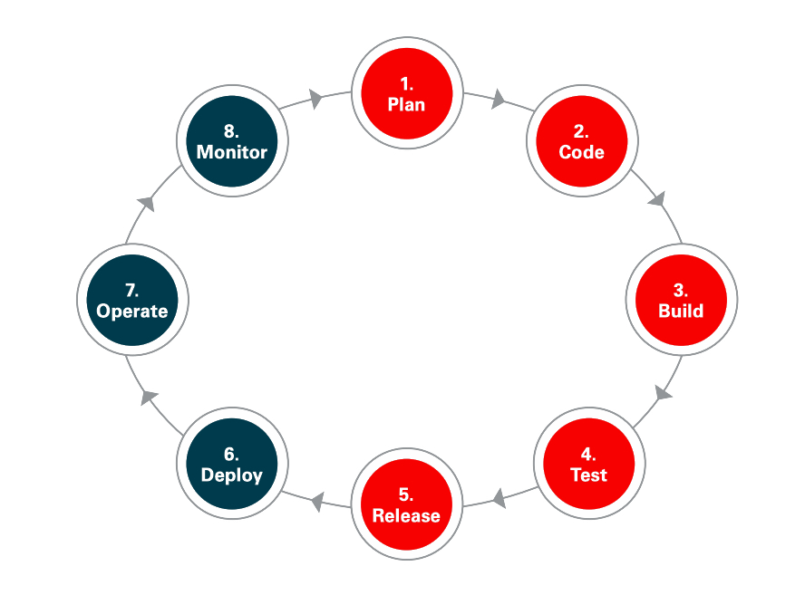
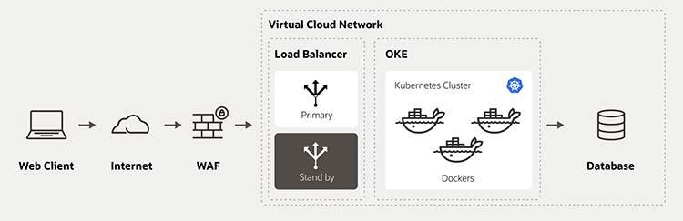
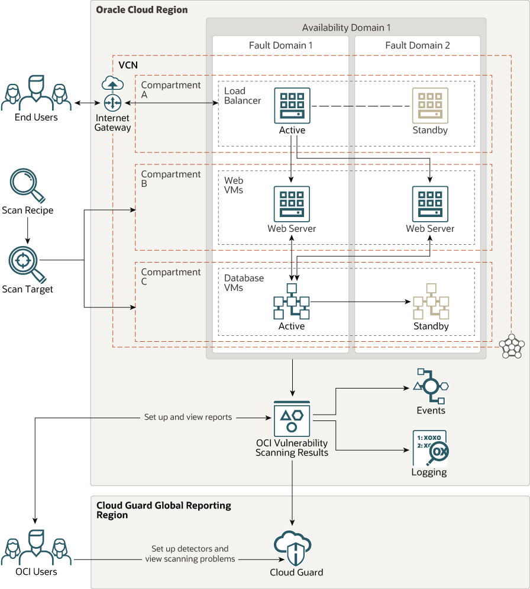
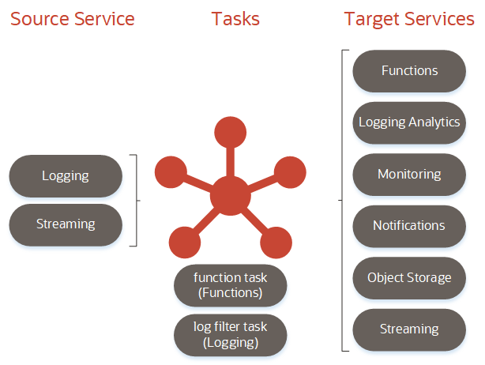

# 02 - Layanan Cloud

## Tujuan Pembelajaran

1. Mengetahui layanan yang ditawarkan cloud computing khususnya Oracle Cloud Infrastructure (OCI

## Hasil Praktikum
### 1. DevOps

DevOps adalah kombinasi dari dua fungsi yang biasanya diperlakukan secara terpisah: pengembangan dan operasi. Definisi DevOps itu adalah apa. Alasannya bahkan lebih mudah. Metodologi pengembangan standar, komunikasi yang jelas, dan proses terdokumentasi yang didukung oleh platform middleware berbasis standar yang terbukti meningkatkan siklus pengembangan dan manajemen aplikasi, menghadirkan kelincahan, dan menyediakan ketersediaan dan keamanan yang lebih besar untuk infrastruktur TI Anda. Jelas, DevOps adalah tentang menghubungkan orang, produk, dan proses. Pada akhirnya, DevOps adalah tentang menghubungkan TI dengan bisnis. Dengan DevOps dapat menyatukan pengembangan dan operasi untuk menciptakan infrastruktur terpadu yang memaksimalkan produktivitas. Untuk mendukung kedua sisi persamaan, infrastruktur harus cepat, fleksibel, dan scalable, dengan input dan integrasi terkait keamanan dan jaminan kualitas yang dibagikan antara pengembang dan operator/administrator sistem.

Hasilnya adalah model efisien yang memaksimalkan sumber daya saat bekerja dengan laju siklus hidup pengembangan perangkat lunak yang semakin cepat, sesuatu yang menjadi semakin sulit untuk didukung di bawah model pengembangan perangkat lunak tradisional. Pada akhirnya, model DevOps yang kuat memungkinkan bisnis untuk memperbaiki masalah, meningkatkan pertumbuhan pengguna, dan melayani pelanggan dengan lebih baik dengan jalur untuk mengembangkan dan mengulangi produk perangkat lunak lebih cepat.

#### Bagaimana DevOps dapat mempercepat pengembangan produk Anda?

DevOps dan DevSecOps menyediakan sarana untuk memenuhi kebutuhan siklus hidup pengembangan perangkat lunak (SDLC) untuk menyediakan integrasi berkelanjutan dan pengiriman berkelanjutan (CI/CD). Mengintegrasikan pengembangan, operasi, dan keamanan memberikan manfaat praktis untuk sumber daya sekaligus memungkinkan komunikasi dan kolaborasi yang lebih cepat di seluruh siklus hidup. Kemampuan untuk membangun jembatan di antara kelompok-kelompok ini—semuanya sambil memperpendek siklus hidup pengembangan perangkat lunak secara keseluruhan—memberi DevOps makna dan nilai, apa pun industrinya.

#### Manfaat DevOps
Mengadopsi DevOps untuk mendukung seluruh siklus hidup pengembangan perangkat lunak—dengan penekanan pada kelincahan dan efisiensi terlepas dari fungsinya memberikan sejumlah manfaat:

Enabling speed : Dengan model DevOps yang gesit, teknologi dioptimalkan untuk kebutuhan siklus hidup saat ini. Dalam banyak kasus, DevOps menggunakan pembelajaran mesin mutakhir dan kecerdasan buatan untuk mempercepat ini. Bahkan, istilah baru-baru ini diciptakan, AIOps, mengacu pada penggunaan kecerdasan buatan dalam operasi TI. DevOps juga menekankan otomatisasi dan integrasi/pengiriman berkelanjutan, mengurangi staf dari tugas manual untuk fokus pada inovasi. Di sisi pengembangan, para insinyur dapat mencapai tonggak kode mereka lebih cepat atau berkolaborasi dengan lebih efektif. Di sisi operasi, administrator sistem dapat memanfaatkan kerangka kerja otomatisasi untuk menyediakan dan memperbarui aplikasi dan infrastruktur baru dengan mudah.

Quality : Dengan mengaktifkan kecepatan, DevOps membuka jalur baru menuju kualitas dan keandalan yang lebih baik. Ini dimulai dari sisi pengembangan, dengan kolaborasi yang lebih cepat dan alat yang lebih baik untuk pemecahan masalah dan integrasi. Di sisi operasi, pembaruan yang lebih kecil dan lebih sering memungkinkan stabilitas yang lebih besar, yang meningkatkan kualitas pengalaman keseluruhan untuk basis pengguna.

Keamanan: Menggunakan DevOps menyediakan beberapa lapisan berbeda untuk meningkatkan keamanan Anda secara keseluruhan. Dari perspektif fungsional, DevOps terkadang menyertakan integrasi tim keamanan. Ini menciptakan model yang terkadang disebut sebagai DevSecOps, yang sama-sama menyeimbangkan keamanan di samping kebutuhan pengembangan dan operasional. Pada tingkat yang lebih terperinci, kecepatan DevSecOps memungkinkan patching cepat, audit, dan analisis yang didukung oleh kecerdasan buatan, kepatuhan otomatis, dan manajemen sumber daya otomatis.

Scalability: Sumber daya yang gesit, otomatisasi, dan kemampuan untuk mendukung siklus hidup pengembangan perangkat lunak yang lengkap berarti bahwa infrastruktur siap untuk mendukung penskalaan sesuai kebutuhan. Karena penskalaan menyentuh banyak elemen berbeda, mendukung pandangan holistik tentang teknologi membantu penskalaan secara efisien sambil menangani segala hal mulai dari pengelolaan sumber daya hingga peluncuran patch.

### 2. Web Application Firewall

Web Application Firewall membantu melindungi aplikasi web dari serangan berbahaya dan lalu lintas internet yang tidak diinginkan, termasuk bot, injeksi, dan penolakan layanan (DoS) lapisan aplikasi. WAF akan membantu Anda membuat dan mengelola aturan untuk menghindari ancaman internet, termasuk alamat IP, header HTTP, badan HTTP, string URI, skrip lintas situs (XSS), injeksi SQL, dan kerentanan lain yang ditentukan OWASP. Firewall aplikasi web dikerahkan untuk melindungi aplikasi yang menghadap web dan mengumpulkan log akses untuk kepatuhan, dan analytics.

#### Komponen Layanan Web Application Firewall
A. Web application firewall policy
Kebijakan WAF mencakup keseluruhan konfigurasi layanan WAF Anda, termasuk manajemen asal, pengaturan aturan perlindungan, dan fitur deteksi bot

B .Origin
Server host asal aplikasi web Anda, yang dirancang untuk menyiapkan aturan perlindungan atau fitur lainnya, seperti yang ditentukan dalam kebijakan WAF Anda.

C. Protection rules
Aturan perlindungan dapat dikonfigurasi untuk mengizinkan, memblokir, atau mencatat permintaan jaringan saat memenuhi kriteria aturan perlindungan yang ditentukan. WAF akan mengamati lalu lintas ke aplikasi web Anda dari waktu ke waktu dan menyarankan aturan baru untuk diterapkan.

D. Bot management
Layanan WAF mencakup beberapa fitur yang memungkinkan Anda mendeteksi dan memblokir atau mengizinkan lalu lintas bot yang teridentifikasi ke aplikasi web Anda. Fitur manajemen bot termasuk tantangan JavaScript, t antangan CAPTCHA, dan daftar putih GoodBot. Solusi manajemen bot dapat menggunakan teknik deteksi seperti pembatasan kecepatan IP, CAPTCHA, sidik jari perangkat, dan tantangan interaksi manusia untuk mengidentifikasi dan memblokir aktivitas bot yang mencurigakan di aplikasi web Anda. Pada saat yang sama, WAF dapat mengizinkan lalu lintas bot yang sah dari penyedia bot yang diterbitkan untuk melewati kontrol ini.

#### Manfaat WAF 
Web Application Firewall (WAF) menyaring permintaan berbahaya ke aplikasi web atau API. Ini juga memberikan lebih banyak visibilitas tentang dari mana lalu lintas berasal—dan serangan penolakan layanan (DDos) terdistribusi Layer 7 dimitigasi, untuk membantu mendapatkan ketersediaan aplikasi, dan menegakkan mandat kepatuhan dengan lebih baik.

Solusi manajemen bot menggunakan teknik deteksi seperti pembatasan kecepatan IP, CAPTCHA, sidik jari perangkat, dan tantangan interaksi manusia untuk mengidentifikasi dan memblokir aktivitas bot yang buruk dan/atau mencurigakan agar tidak mengorek situs web Anda untuk mendapatkan data kompetitif. Pada saat yang sama, WAF dapat mengizinkan lalu lintas bot yang sah dari Google, Facebook, dan lainnya untuk terus mengakses aplikasi web Anda sebagaimana dimaksud. WAF menggunakan Domain Name System (DNS) yang cerdas menggunakan algoritme berbasis data yang menentukan titik kehadiran global (POP) terbaik untuk melayani pengguna tertentu secara real time. Akibatnya, pengguna diarahkan di sekitar masalah jaringan global dan potensi latensi sambil menawarkan waktu kerja dan tingkat layanan terbaik.

### 3. Vulnerability Scanning 

Oracle Vulnerability Scanning Service membantu meningkatkan keamanan di Oracle Cloud dengan secara rutin memeriksa host untuk kemungkinan kerentanan. Layanan menghasilkan laporan dengan metrik dan detail tentang kerentanan ini.

Layanan Pemindaian dapat mengidentifikasi beberapa jenis masalah keamanan dalam komputer instance :

Port yang dibiarkan terbuka secara tidak sengaja mungkin menjadi vektor serangan potensial ke sumber daya cloud Anda, atau memungkinkan peretas mengeksploitasi kerentanan lainnya.
Paket OS yang memerlukan pembaruan dan tambalan untuk mengatasi kerentanan
Konfigurasi OS yang mungkin dieksploitasi oleh peretas
Tolok ukur standar industri yang diterbitkan oleh Center for Internet Security (CIS).
Layanan Pemindaian memeriksa host untuk kepatuhan dengan tolok ukur bagian 5 (Akses, Otentikasi, dan Otorisasi) yang ditentukan untuk Distribusi Independen Linux.

Layanan Pemindaian dapat memindai instans komputasi individual, atau dapat memindai semua instans komputasi dalam kompartemen dan subkompartemennya. Jika Anda mengonfigurasi layanan Pemindaian di kompartemen root, maka semua instans komputasi di seluruh penyewaan akan dipindai.

Layanan Pemindaian mendeteksi kerentanan di platform berikut:]
1. Oracle Linux
2. CentOS
3. Ubuntu
4. Windows (tidak ada tolok ukur CIS)

#### Konsep 
Memahami konsep dan komponen utama yang terkait dengan layanan Scanning.

Diagram berikut memberikan gambaran tingkat tinggi dari layanan.

1. Scan Recipe : Memindai parameter untuk jenis sumber daya cloud, termasuk informasi apa yang harus diperiksa dan seberapa sering.
2. Target : Satu atau beberapa sumber daya cloud yang ingin Anda pindai menggunakan resep tertentu. Sumber daya dalam target memiliki jenis yang sama, seperti instance komputasi.
3. Host Scan : Metrik tentang resource cloud tertentu yang dipindai, termasuk kerentanan yang ditemukan, tingkat risikonya, dan kepatuhan benchmark CIS. Layanan Pemindaian menggunakan agen host untuk mendeteksi kerentanan ini.
4. Port Scan : Buka port yang terdeteksi pada sumber daya cloud tertentu yang dipindai. Layanan Pemindaian dapat mendeteksi port terbuka menggunakan agen host, atau menggunakan pemetaan jaringan yang mencari alamat IP publik Anda.
5. Vulnerabilities Report : Informasi tentang jenis kerentanan tertentu yang terdeteksi di satu atau beberapa target, seperti pembaruan yang hilang untuk paket OS.
(Lampirkan screenshot hasil praktik di sini selengkap mungkin sesuai tujuan pembelajaran yang ingin dicapai)

### 4. Storage Gateway
Storage Gateway adalah gateway penyimpanan cloud yang memungkinkan Anda menghubungkan aplikasi lokal dengan Oracle Cloud Infrastructure. Aplikasi yang dapat menulis data ke target NFS juga dapat menulis data ke Oracle Cloud Infrastructure Object Storage, tanpa memerlukan modifikasi aplikasi untuk mengambil REST API.

#### Konsep Storage Gateway :
1. FILE SYSTEM
Sistem file Storage Gateway pada host lokal memetakan file dan direktorinya ke objek dengan nama yang sama di bucket Penyimpanan Objek Infrastruktur Cloud Oracle yang sesuai.

2. FILE SYSTEM CACHE
Cache sistem file Storage Gateway yang dapat dikonfigurasi memungkinkan pergerakan data yang asinkron dan dioptimalkan ke cloud. Cache sistem file berfungsi sebagai buffer tulis dan cache baca untuk penyimpanan dan pengambilan data. Buffer tulis berisi data yang disalin ke cache disk dan diantrekan untuk diunggah ke Oracle Cloud Infrastructure. Cache baca berisi data yang sering diambil yang dapat diakses secara lokal untuk operasi baca. Konfigurasi cache sistem file yang tepat sangat penting untuk kinerja Storage Gateway. Lihat Mengonfigurasi Cache untuk Sistem File untuk detailnya.

3. METADATA
Metadata yang terkait dengan file Storage Gateway disimpan sebagai metadata khusus untuk objek terkait di Oracle Cloud Infrastructure Object Storage. Contoh metadata file termasuk id objek, tanggal pembuatan, tanggal modifikasi, ukuran, dan izin. Storage Gateway menyimpan semua metadata untuk sistem file secara lokal.

4. NFSV4
NFS adalah protokol sistem file terdistribusi yang mapan dan diadopsi secara luas untuk menangani penyimpanan jaringan. NFS memungkinkan komputer klien memasang sistem file pada server jarak jauh dan mengakses sistem file jarak jauh tersebut melalui jaringan seolah-olah mereka adalah sistem file lokal. Storage Gateway melakukan terjemahan NFS ke REST API yang diperlukan untuk berinteraksi dengan Oracle Cloud Infrastructure Object Storage.

5. ORACLE CLOUD INFRASTRUCTURE
Oracle Cloud Infrastructure adalah seperangkat layanan cloud pelengkap yang memungkinkan Anda membangun dan menjalankan berbagai aplikasi dan layanan dalam lingkungan host yang sangat tersedia. Oracle Cloud Infrastructure menawarkan kemampuan komputasi kinerja tinggi (sebagai instans perangkat keras fisik) dan kapasitas penyimpanan dalam jaringan virtual overlay fleksibel yang dapat diakses dengan aman dari jaringan lokal Anda.

6. TENANCY
Penyewaan adalah partisi yang aman dan terisolasi dalam Oracle Cloud Infrastructure tempat Anda dapat membuat, mengatur, dan mengelola sumber daya cloud Anda.

#### Cara Kerja Storage Gateway 
Storage Gateway dipasang di instans komputasi Oracle Cloud Infrastructure atau sebagai instans Docker Linux pada satu atau beberapa host di pusat data lokal Anda. Aplikasi menyimpan dan mengambil objek dari Oracle Cloud Infrastructure Object Storage melalui sistem file yang Anda buat di Storage Gateway.

Storage Gateway memperlihatkan titik pemasangan NFS yang dapat dipasang ke host mana pun yang mendukung klien NFSv4. Titik pemasangan Gateway Penyimpanan dipetakan ke bucket Object Storage.

Ada transparansi file-ke-objek antara Storage Gateway dan Object Storage:

1. Direktori sistem file Storage Gateway pada host lokal dipetakan ke bucket dengan nama yang sama di Oracle Cloud Infrastructure Object Storage.

2. File apa pun yang ditulis ke sistem file Storage Gateway ditulis sebagai objek dengan nama yang sama di bucket Object Storage terkait. Sistem menyimpan atribut file terkait sebagai metadata objek. File yang ditulis diupload ke bucket Object Storage terkait secara asinkron.

3. Anda dapat mengakses objek Object Storage secara langsung menggunakan API asli, SDK, alat pihak ketiga, konektor HDFS, serta Oracle Cloud Infrastructure CLI dan Console. Anda menggunakan operasi Refresh di Storage Gateway untuk menyerap data apa pun yang ditambahkan atau dimodifikasi secara langsung di Object Storage.

Aplikasi perusahaan biasanya bekerja dengan file di direktori bersarang. Bucket Object Storage, dan objek di dalam bucket tersebut, ada dalam hierarki datar. Storage Gateway meratakan hierarki direktori menjadi awalan objek bersarang di Object Storage. Lihat Berinteraksi dengan Penyimpanan Objek untuk detailnya.

### 5. Service Connector Hub

Service Connector Hub adalah platform bus pesan cloud yang menawarkan panel kaca tunggal untuk mendeskripsikan, mengeksekusi, dan memantau pergerakan data antar layanan di Oracle Cloud Infrastructure.

#### Cara Kerja Service Connector Hubs
Service Connector Hub mengatur pergerakan data antar layanan di Oracle Cloud Infrastructure.
Data dipindahkan menggunakan konektor layanan. Konektor layanan menentukan layanan sumber yang berisi data yang akan dipindahkan, tugas opsional, dan layanan target untuk pengiriman data saat tugas selesai. Tugas opsional mungkin tugas fungsi untuk memproses data dari sumber atau tugas filter log untuk memfilter data log dari sumber.

#### Konsep Service Connector Hubs
Konsep berikut ini penting untuk bekerja dengan Service Connector Hub.
1. service connector
Definisi data yang akan dipindahkan. Konektor layanan menentukan layanan sumber, layanan target, dan tugas opsional.

2. source
Layanan yang berisi data yang akan dipindahkan sesuai dengan tugas yang ditentukan—misalnya, Logging.
3. target
Layanan yang menerima data dari sumbernya, sesuai dengan tugas yang ditentukan. Layanan target tertentu memproses, menyimpan, atau mengirimkan data yang diterima—layanan Fungsi memproses data yang diterima; layanan Logging Analytics, Monitoring, Object Storage, dan Streaming menyimpan data; dan layanan Notifikasi mengirimkan data.
4. Task
Pemfilteran opsional untuk diterapkan ke data sebelum memindahkannya dari layanan sumber ke layanan target.
5. Trigger
Kondisi yang harus dipenuhi agar konektor layanan dapat berjalan. Saat ini, pemicunya terus menerus; yaitu, konektor layanan berjalan terus menerus.

#### Flow Data
Saat konektor layanan berjalan, konektor layanan menerima data dari layanan sumber, menyelesaikan tugas opsional pada data (seperti pemfilteran), lalu memindahkan data ke layanan target.

