# 03 - Membuat Virtual Machine

## Tujuan Pembelajaran

1. Mengetahui layanan Oracle Cloud Infrastructure Compute
2. Mampu membuat Virtual Machine (VM) di layanan compute Oracle Cloud

## Hasil Praktikum

Berikut ini adalah bukti telah berhasil membuat VM Ware pada Oracle Cloud.

1.  Setelah berhasil login pada beranda pilih menu compute kemudia klik instance.
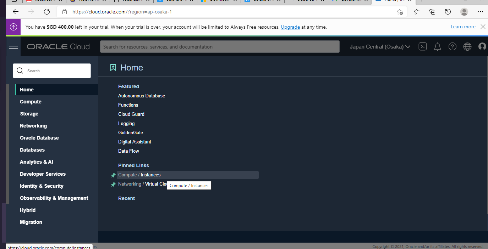

2. Lalu klik **Create Instance** unutuk membuat VM baru.
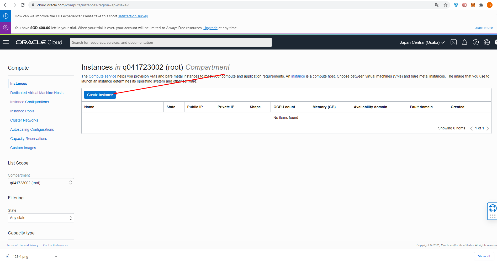

3. Beri nama VM yang kita buat.
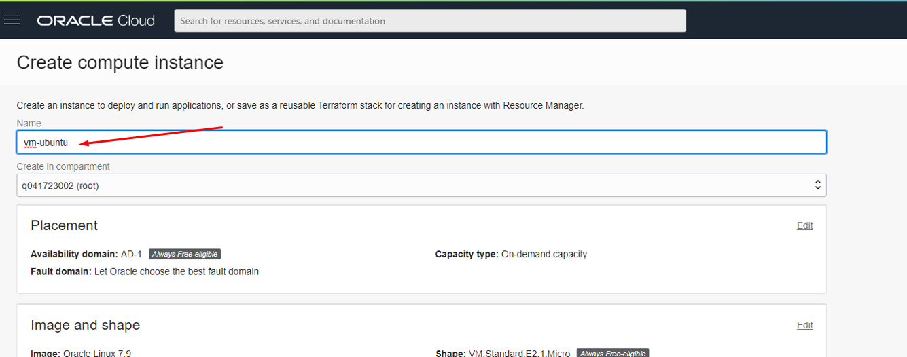

4. Lakukan edit pada **image and shape** kemudian klik change image.
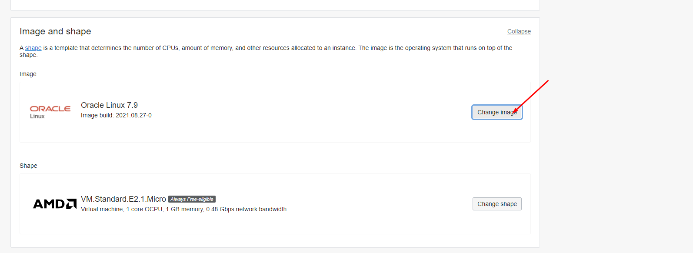

5. Pilih **Canonical Ubuntu versi 20.04**, lalu klik Select image.

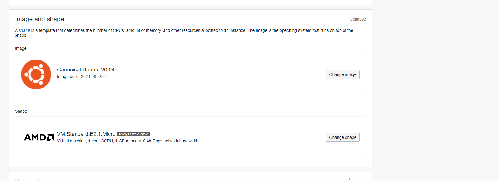

6. Pada tahap ini jangan lupa wajib menyimpan **SSH Keys** dengan klik Save Private Key untuk mengunduh private key milik kita agar nanti VM bisa diakses.

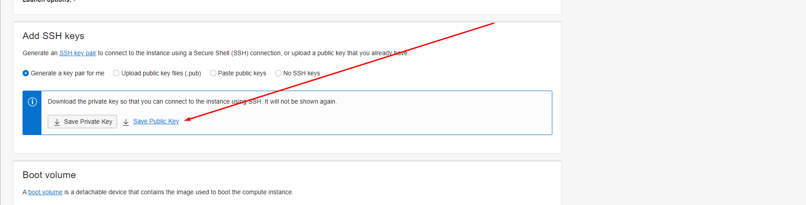

7. Tahap terakhir klik create untuk membuat VM Ware.

8. Tunggu proses pembuatan VM Ware berhasil jika selesai pada bagian compute 100%.

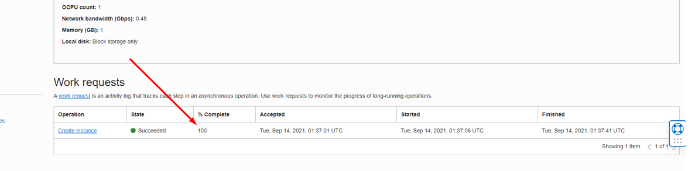

## Tugas 
### Carilah cara agar Anda dapat melakukan SSH ke VM yang baru dibuat berdasarkan praktikum tersebut!

1. Buka **PUTTYYGen** kemudian klik load.
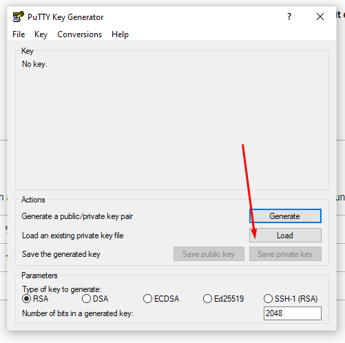

2. Lalu klik save private key untuk export private key ke direktori lokal kita.
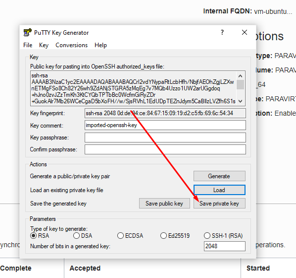

3. Kemudian buka aplikasi Putty klik Host Name masukan ip public.
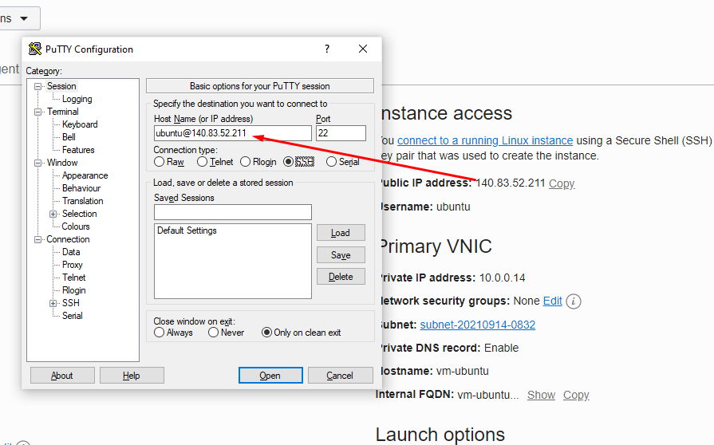

4. Pindah ke category pilih SSH expand ke AUTH kemudian import file private key yang tadi kita export. 
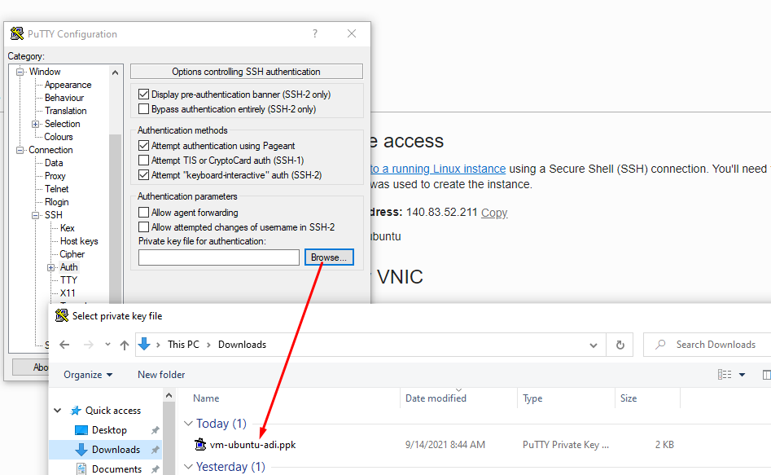

5. Berikutnya klik open untuk lanjut akses VM Ware.
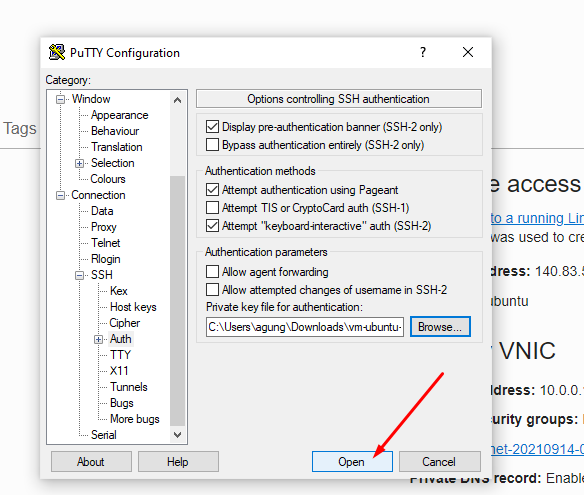

6. Berhasil melakukan login ke VM Ware dengan Terminal Putty.
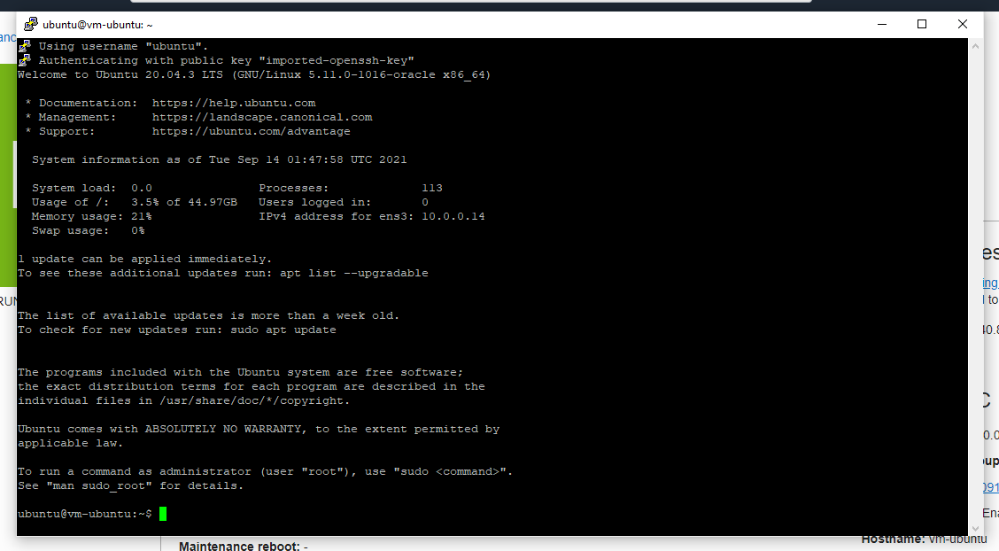

