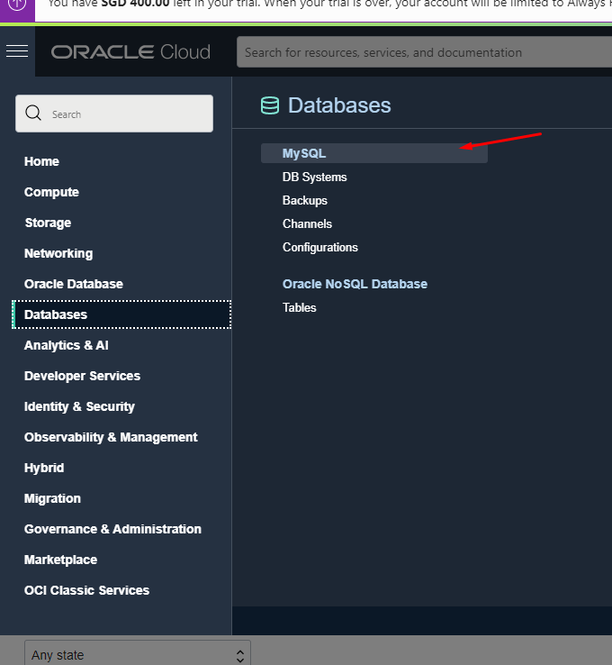

# 05 - Setup MYSQL

## Tujuan Pembelajaran

1. Mengetahui layanan yang ditawarkan cloud computing khususnya Oracle Cloud Infrastructure (OCI)

## Hasil Praktikum

## Praktikum 1: Membuat Mysql

Berikut ini adalah bukti telah berhasil membuat Mysql pada Oracle Cloud.

1.   Buka pannel pilih databases kemudian kunjungi MySql

2.   Buat database mysql

3.   Konfigurasi seperti dibawah ini.

4.   Tunggu Creating mysql sampai menjadi hijau.

5.   Kemudian lakukan setting port mysql

6.   Kemudian menuju CMD akses ssh dengan private key lalu install mysql.

7.   Lalu login mysql pada cmd menggunakan user, ip private dan password yang dibuat.

## Tugas : Tugas Praktikum Paas

### Cari aplikasi php yang memiliki database kemudian upload ke server dan buat databasenya.

1.  Cek dulu isi database.

2.  Create database terlebih dahulu kemudian use cek isi table. Masih kosong karena belum di import.

3.  Paste query sql dari database yang telah di export pada xamp kemudian save file sql pada direktori ubuntu.

4.  Lakukan import file sql yang telah dibuat ke mysql server.

5.  Terakhir cek database db_larabook akan terisi data tabel dari hasil import.

