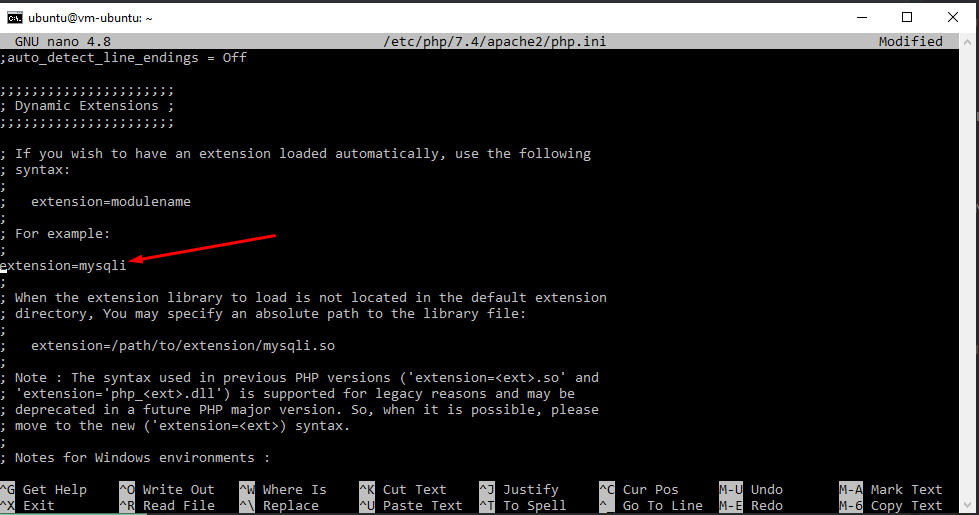

# 06 - Kuis Setup Wordpress 

## Tujuan Pembelajaran

1. Mengetahui layanan PaaS yang ditawarkan Oracle Cloud Infrastructure (OCI)
2. Dapat memanfaatkan layanan PaaS yang ditawarkan Oracle Cloud Infrastructure (OCI)

## Praktikum Praktikum Wordpress + Pointing Database

Berikut ini adalah bukti telah berhasil membuat wordpress dan  pointing ke instance DB.

1. Buat database wordpress, cek database yang telah dibuat, lalu beri izin database wordpress untuk admin.

2. Download wordpress pada folder /var/www 

3. Ekstrak wordpress tadi ke folder /var/www/html

4. Install extension mysql pada php.

5. lalu aktifkan extension mysql dengan edit php.ini, ketikan perintah sudo nano /etc/php/7.4/apache2/php.ini

6. Lakukan restart pada apache 2

7. berikutnya lakukan tahapan instalasi pointing wordpress ke db pada browser.

8. isi sesuai dengan database yang telah dibuat.

9. Lalu isi juga pada bagian ini untuk login pada wordpress. 

10. Jika sukses akan di arahkan halaman login ke wordpress isi dengan data yang sebelumnya.

11. wordpress berhasil terinstall

12. Tampilan halaman dashboard wordpress.

