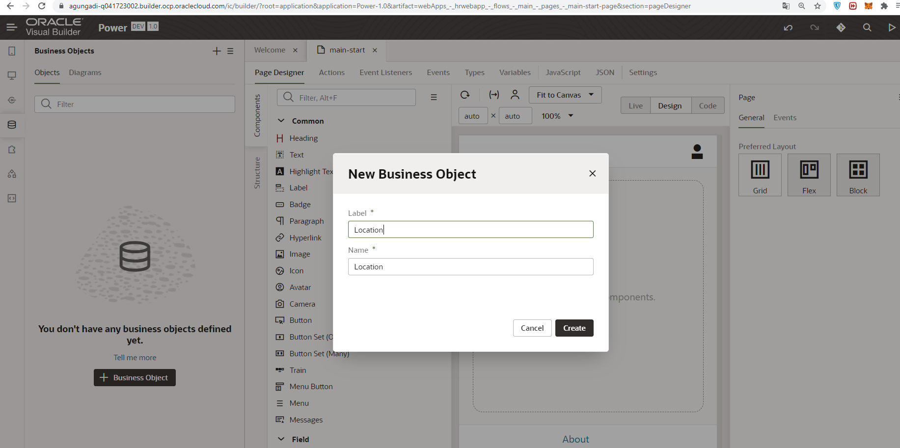
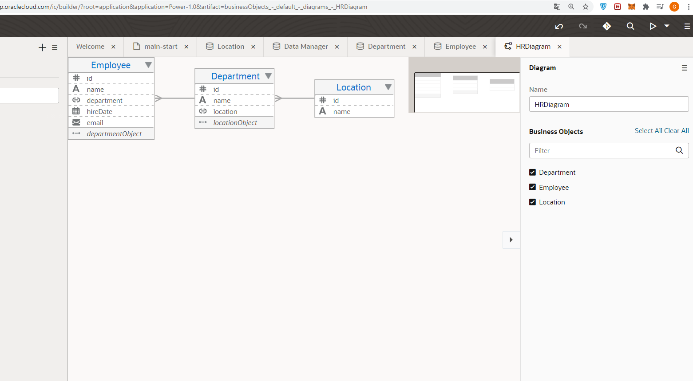
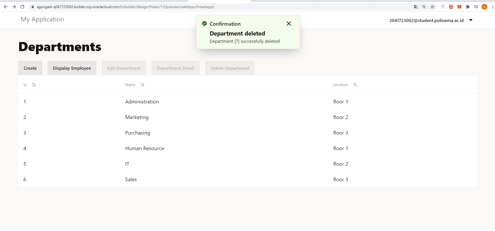
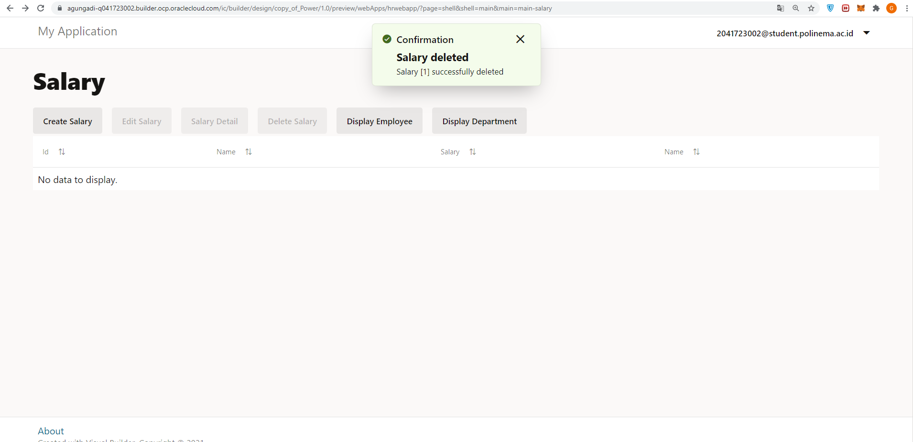

# 05 - Setup SaaS

## Tujuan Pembelajaran

1. Mengetahui layanan Oracle Cloud Infrasturcture Software as a Service.
2. Mampu mengguankan layanan software layanan oracle.

## Hasil Praktikum

## Praktikum 1: Membuat Visual Builder

Berikut ini adalah bukti telah berhasil membuat Mysql pada Oracle Cloud.

1. Membuat Aplikasi (Create Web Application)
Login OCI -> Pilih OCI Classic Service -> Create Instace.
Isi nama instace, nama, deskripsi dari instance, Region dan tag

2. Hasil instance yang telah dibuat:

3. Kemudian pilih Open Visual Builder Home Page

4. Tunggu beberapa saat, kemudian jika berhasil akan muncul halaman berikut. Klik New Application

5. Isi informasi tentang aplikasi yang akan dibuat

6. Berhasil dibuat

7. Pada sisi kiri adalah menu dari (kotak berwarna merah) visual builder dari aplikasi yang akan kita buat, pilih ikon web kemudian akan muncul menu berikut : 

8. Expand hrwebapp, kita akan melihat struktur struktur dari aplikasi web,kurang lebih seperti gambar dibawah ini:

## Import Location Busines dari file

## Department Business Object

1. Pada new Business Object dialog Box, Pada field label isi dengan “Department”.

2. Isi field seperti dibawah :

## Employee Business Object

1. Pada new Business Object dialog Box, Pada field label isi dengan Employee.

2. Isi field seperti dibawah :

3. Hasil Diagram : 

## main-start Page untuk Display Departments

## Halaman Create untuk Employee Busines Object

## Action Chain halaman Departments ke halaman Employess

## Import Data ke Busines Object

## Halaman Edit Detail Delete Department Busines Object (data manipulation)

## Halaman Edit Detail Delete Employee Busines Object (data manipulation)

## Stage and Publish

# Tugas

1. Membuat Database Salary

2. Membuat field pada database salary

3. Melihat diagram relasi database

4. Membuat heading Main-salary

5. Test Data Manipulation Salary page view.

