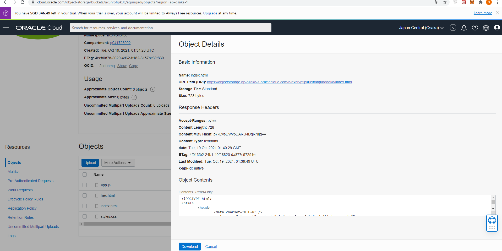
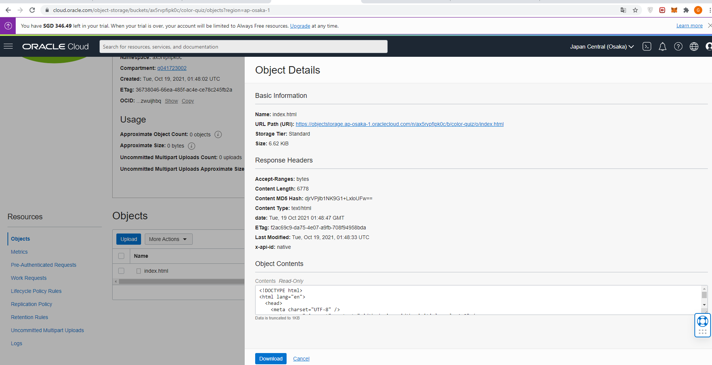

# 08 - Setup Object Storage

## Tujuan Pembelajaran

1. dapat menyimpan atau mengambil data langsung dari internet 
atau dari dalam platform cloud

## Hasil Praktikum

1. Membuat bucket untuk website. Sign-in ke OCI kemudian pilih Object Storage.

2.   Create Bucket → Pilih standar bucket.

3.   Buka bucket dengan melakukan klik pada nama bucket kemudian pilih Edit Visibility. Pilih Visibility menjadi Public. Tekan Save Changes untuk menyimpan perubahan.

4. Uploading web page. Pada bagian bawah dari Bucket Information terdapat box Object (upload semua file yang ada pada folder colorFliper)

5. Kemudian pilih View Object Detail (Panel detail akan menunjukkan detail URL objek)

6. Kemudian pilih URL Path (URI) untuk membuka file 

7. Jika file yang di upload berhasil tampilan pada halaman akan seperti pada gambar di bawah ini:

## Tugas

1. Buat Bucket baru lagi saya beri nama color-quiz

2. Buka bucktet yang telah dibuat kemudian edit visibility menjadi public.

3. Upload web static index.html.

4. Setelah berhasil di upload klik view Object Details.

5. Klik url path untuk melihat web static yang telah di public.

6. Web static berhasil di public di akses seperti dibawah ini.

