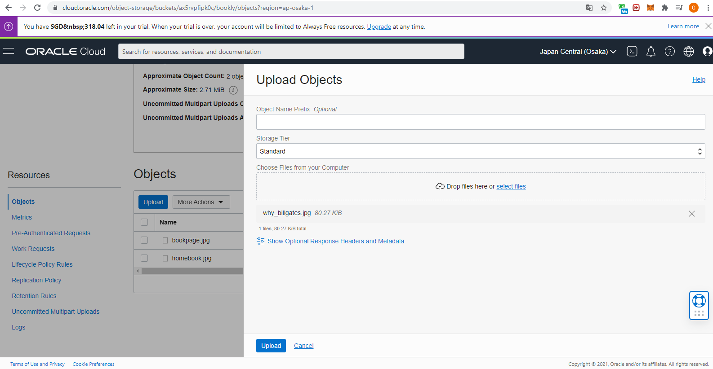

# 08 - UTS

## Tujuan Pembelajaran

1. dapat menyimpan atau mengambil data langsung dari internet 
atau dari dalam platform cloud
2. Dapat menampilkan file dari Object Storage ke Wordpress
3. Konfigurasi VM 
4. DB Instace Import sql ke database Wordpress

## Hasil Praktikum Wordpress + Object Storage

1. Upload Terlebih dahulu file image ke object storage.

2. Setelah berhasil di upload klik object details salin link URI image.

3.  Paste URI ke dalam komponen image di wordpress

4. Upload lagi file image untuk sampul buku.

5. Salin uri nya kemudian paste pada komponen image di wordpress.

6. Kemudian akan tampil sampul foto yang di ambil dari object storage.

7. Berikutnya akan mencoba upload file video pada object storage.

8. Pada komponen video di wordpress paste url dari object storage.

9. Maka video berhasil di insert pada wordpress.

10. Selanjutnya melakukan upload file pdf pada object storage.

10. Setelah berhasil di upload salin URI file pdf tersebut.

10. Paste uri ke link text yang nanti sebagai object click.

11. Lalu coba kunjugi wordpress kemudian klik object read yang tadi ada link uri pdf, akan direct download pdf yang berada di object storage.

##  Hasil Praktikum Wordpress + VM + DB Instance

1. Pertama lakukan import file sql book yang berisi data table buku ke database wordpress.

2. Lalu Cek pada database wordpress apa sudah berhasil di import untuk table buku.

3. Kemudian menuju folder /var/www/html/wp-content/themes edit script php untuk membaca database table buku seperti di bawah ini.

4. Setelah itu akses wordpress untuk melihat table yang read dari database wordpress buku

## Tampilan website Wordpress

### Link Wordpress : http://140.83.52.211/index.php/blog/

1. Home

2. Tables Header List Buku

3. Rules 

4. Buku

5. Contact

