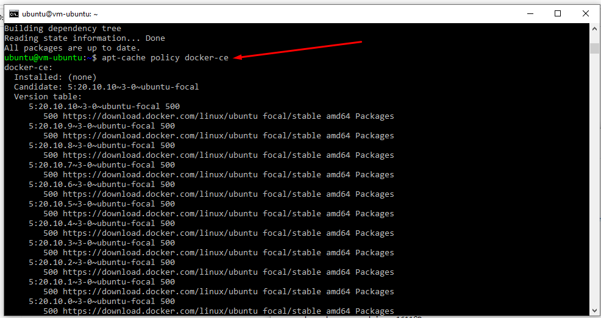
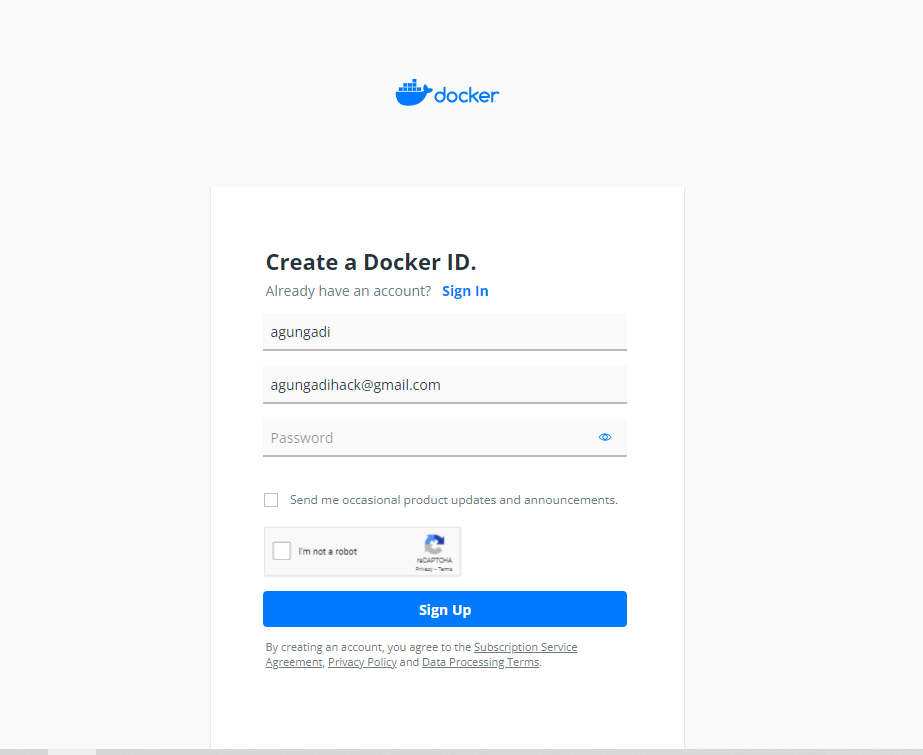

# 10 - Docker

## Tujuan Pembelajaran

1. Agar dapat menjalankan container maka diperlukan installasi docker di host, docker sudah 
support beberapa sistem operasi seperti windows ataupun keluarganya unix

## Hasil Praktikum

1. Install Docker.

Silakan masuk ke virtual mesin Anda kemudian jalankan perintah di bawah ini

Install paket yang dibutuhkan sebelum melakukan installasi docker, jalankan perintah di bawah ini.

Langkah selanjutnya yaitu menambahkan repository docker, dengan beberapa baris perintah di bawah ini

### Silakan lakukan installasi menggunakan perintah berikut ini

Ketika progress installasi sudah selesai, kemudian cek apakah docker daemon sudah 
jalan menggunakan perintah systemctl.

Jika menampilkan status active (running), berarti docker daemon sudah berjalan. Untuk 
lebih jelasnya perhatikan output di bawah ini

### Untuk memastikan kembali, kita butuh menggunakan image test apakah docker benarbenar berjalan sebagaimana semestinya. Gunakan perintah di bawah ini

### Untuk menjalankan perintah docker tanpa menggunakan sudo, berikut ini perintahnya Agar memberikan perubahan, logout terlebih dahulu kemudian login kembali. Jalankan perintah docker tanpa menggunakan sudo seperti berikut

2. Membuat Container

Ketika kita mengembangkan aplikasi web tentunya membutuhkan sebuah web server, hal yang 
sering dilakukan dengan melakukan installasi paket tersebut diikuti dengan Langkah-langkah 
yang lain. Dengan docker, kita cukup satu baris perintah apache sudah bisa berjalan. Berikut 
ini perintahnya

Perintah di atas digunakan untuk membuat container dengan nama contoh-apache dengan 
mengexpose port 8080 dari port defaultnya 80, sedangkan image yang digunakan adalah httpd 
yang merupakan layanan web server apache. Parameter -d digunakan untuk menjalankan 
containersecara background. Silakan cek menggunakan telnet seharusnya sudah bisa terhubung 
seperti pada gambar berikut

3. Membuat Akun Docker Hub

Silakan menuju halaman https://hub.docker.com/signup, akan memuat halaman berikut kemudian lakukan pendaftaran akun 

4. Build Image

• Clone project yang terdapat di https://gitlab.com/0d3ng/cloud-docker-java-sample.git

• masuk ke dalam direktori tersebut dan jalankan perintah build seperti berikut

Jika kita ingin upload ke docker hub kita, silakan login dulu menggunakan perintah di bawah 
ini

Selanjutnya kita upload image yang telah kita buat menggunakan perintah di bawah ini

Silakan cek docker hub Anda

## Tugas

1. Clone github project yang akan digunakan

2. kemudian membuat filedocker lalu isikan sebagai berikut :

3. Lakukan build omage ke dalam container docker :

4. Lakukan pengecekan apakah docker images sudah masuk container :

5. Run container pada VM oracle :

6. Login docker :

7. lakukan push container ke dalam docker hub :

8. Cek repository ke web docker hub :

