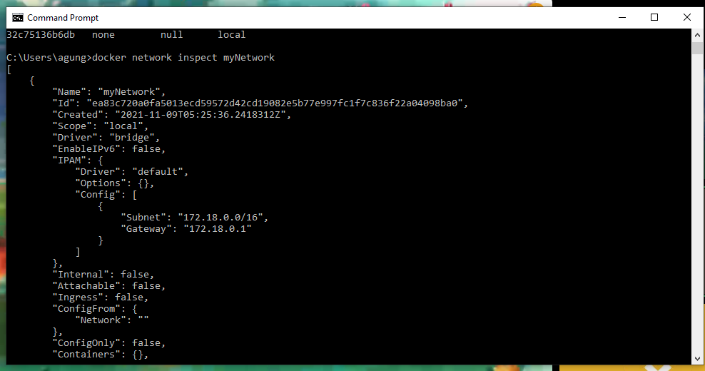
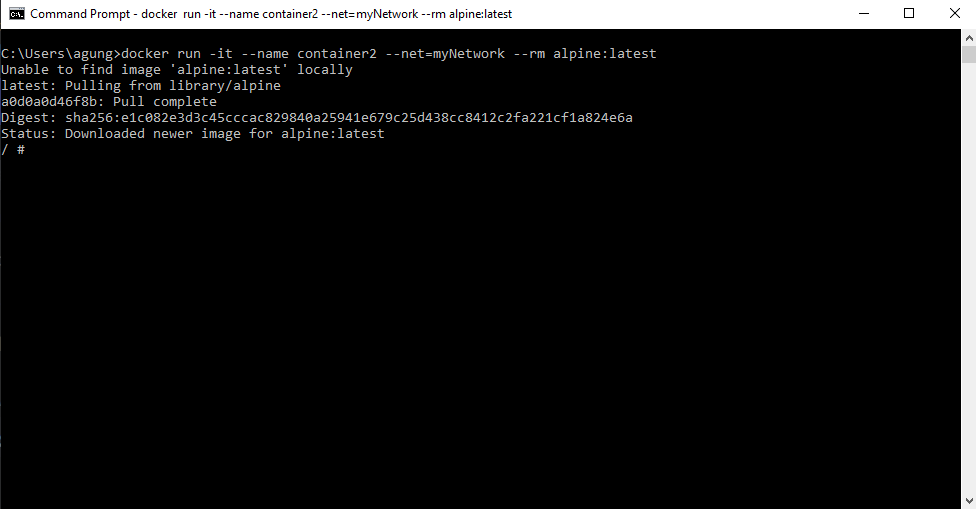
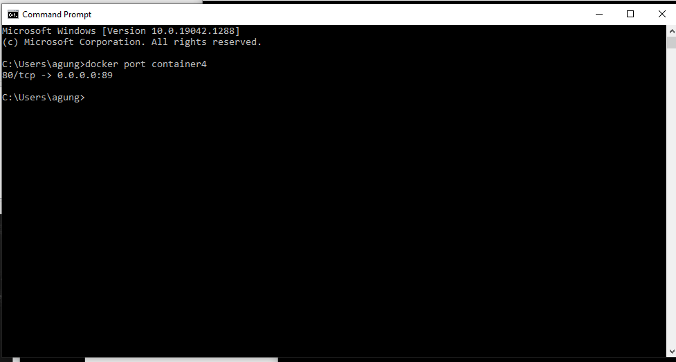
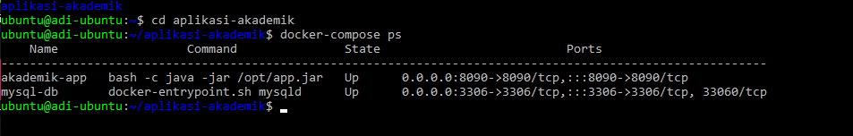
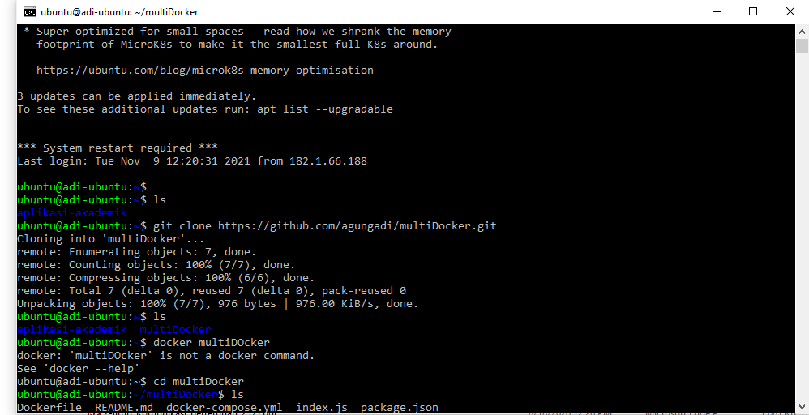
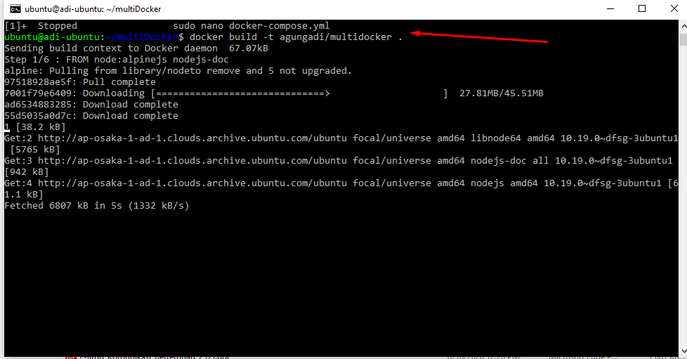

# 11 - Docker 2

## Tujuan Pembelajaran

1. Agar dapat menjalankan container dan docker compose maka di host dengan menggunakan windows dan keluarga unix.

## Hasil Praktikum

### 1.1 Membuat dan Memeriksa Docker Network

1. Pertama ketik perintah di bawah ini untuk mengetahui network yang tersedia pada 
docker host kit

2. Selanjutnya untuk mengetahui perintah-perintah dasar yang bisa digunakan untuk 
docker network

3. Selanjutnya cek network yang sudah dibuat menggunkan perintah ls, seharusnya 
akan menambahkan network. Hasilnya adalah sebagai berikut

4. Terakhir, ketika ingin mengetahui informasi detail dari network yang telah kita 
buat bisa menggunakan perintah inspec

### 1.2 Menghubungkan Container ke Network

1. Buat terlebih dahulu contoh container, misalkan kita akan membuat container 
linux yaitu busybox

2. Buat container yang kedua menggunakan image linux alphine, buka windows yang 
baru agar container1 tetap berjalan

3. Kemudian cek masing-masing container tersebut menggunakan perintah ps untuk 
mengetahui status container yang sedang jalan. Buka windows baru, jalankan 
perintah berikut.

4. Kemudian jalankan inspect untuk mengetahui informasi detail dari masing-masing 
container.

### Membuka Port Container

1. ketikan pada browser seperti ditunjukkan di bawah ini

2. Kemudian untuk mengetahui port yang dilakukan expose pada container, bisa 
menggunakan perintah di bawah ini.

## 2. Docker Volume

1. Buat terlebih dahulu folder di host(laptop/computer/vps), misalkan saya buat folder 
docker-shared.

2. Selanjutkan jalankan perintah dengan menambahkan parameter -v seperti berikut 
untuk mapping ke container yang akan kita buat, jangan lupa untuk masuk direktori 
volume, dan membuat file log.txt

3. Cek di folder local Anda, bisa menggunakan perintah ls atau dir. Dapat juga dilihat 
menggunakan windows explorer.

4. Perintah pertama yang bisa dijalankan adalah sebagai berikut, mengecek volume yang 
telah ada sebelumnya dan membuat volume bisa menggunakna perintah di bawah ini.

5. Jalankan container dengan menyertakan volume yang telah kita sebelumnya dan buat 
file log.txt, jangan lupa masuk ke direktori volume terlebih dahlulu.

### 2.2.Menghapus Volume

Untuk menghapus volume yang telah kita buat sebelumnya dapat dilakukan dengan cara 
di bawah ini

## 3. Docker Compose

1. Silakan masuk ke oracle cloud dan ke VM Anda, kemudian install docker compose dengan 
perintah sudo curl -L "https://github.com/docker/compose/releases/download/1.27.4/docker-compose-$(uname -s)-$(uname -m)" -o /usr/local/bin/docker-compose

2. Cek versi docker compose untuk memastikan proses installasi berhasil dilakukan dengan 
perintah

3. Clone repo yang telah disediakan menggunakan git atau download secara manual.

4. Masuk ke direktori tersebut dan ganti branch menjadi cloud-docker dengan perintah seperti 
berikut ini

5.Build image tersebut menggunakan perintah build pada docker.

6. Selanjutnya buat folder data di bawah /opt agar data mysql tidak hilang ketika container 
dihapus

7. Jalankan docker compose menggunakan perintah berikut ini

8. Jalankan docker compose menggunakan perintah berikut ini

7. Jalankan docker compose menggunakan perintah berikut ini

# Tugas

1. Clone repo dari github saya berisi example project nodejs dan redis.

2. Install terlebih dahulu nodejs pada ubuntu

3. Build image project multidocker 

4. Docker compose Up untuk menjalankan docker compose.

5. Kemudian cek container yang berjalan dimana terdapat 2 container yang berjalan yaitu node dan redis.

6. Kemudian open port pada oracle untuk 8080.

7. Terakhir buka browser ketikan 150.230.60.116:8080 maka akan membuka container yang sedang berjalan. dimana aplikasi ini berfungsi counting jumlah visit yang sudah di kunjungi.

## URL tugas : 150.230.60.116:8080