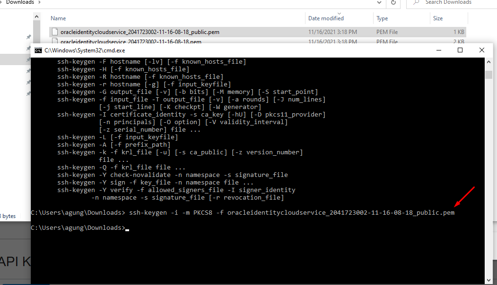

# 12 - Jobsheet 12 – CI/CD

## Tujuan Pembelajaran

1. Agar dapat menerapkan ci/cd pada workflow github dengan menggunakan media oracle cloud dan docker

## Hasil Praktikum

## Hosting Website Static Menggunakan CI/CD Pipeline

1. Menyiapkan bucket object storage pada oracle cloud

2. Menyiapkan Project react dengan menginstall node js kemudian lakukan generate project os-react

3. Publish project os-react tersebut ke github

4. Menambahkan github workflow pada project os-react kemudian push ke github.

5. Pada oracle cloud generate api key kemudian unduh public key dan private key, kemudian pada public key convert menggunakan printah ssh-keygen.

6. Buat nilai secret sesuai nama key value seperti dibawah ini 

7. Cek action pada github untuk mengetahui apakah workflow sudah suskse berjalan juka berwarna hijau menandakan sukses.

8. Kemudian beralih ke bucket akan ada repository yang di upload melalui workflow buka index.

Link Web Static :
https://objectstorage.ap-osaka-1.oraclecloud.com/n/ax5rvpfipk0c/b/os-react/o/index.html

Url Github :
https://github.com/agungadi/os-react

## Hosting Website Static Menggunakan CI/CD Pipeline

1. Pertama publish ke repository github.

2. Buat workflow berinama build.yml kemudian push ke github.

3. Buka docker kemudian ambil akeses token untuk workflow bisa push ke docker.

4. Buat file Dockerfile pada repository project

5. Buat docker-compose.yml pada project

6. Buat secret sesuai key dan value pada jobsheet.

7. Kemudian buka action terjadi error pada workflow ini begitu aneh karena saat saya coba test memakai workflow bucker berhasil sedangkan saat untuk akses instance pada oracle tidak berhasil.

8. Setelah saya selidiki saya ulang beberapa kali tidak dapat memecahkan masalah tersebut. Saya liat pada proses workflow terjadi error saat check instance kemudian tidak mendapatkan ip instance dan ocid instance yang mengakibatkan tidak bisa akses SSH server pada workflow.

9. Untuk proses push ke docker nya berhasil masuk pada reposiory docker.

URL Github :
https://github.com/agungadi/os-react-docker

## Tugas Membuat pipline untuk Project web dinamis

1. disini saya menggunakan OS React Docker untuk test upload web dinamis ke bucket.

2. Edit pada bagian index web dinamis yang akan di upload.

3. Cek pada bagian action apa sudah berhasil berjalan workflow nya.

4. Kemudian buka bucket untuk mendapatkan url website dinamis lalu akses url tersebut.

URL Web Dinamis : 
https://objectstorage.ap-osaka-1.oraclecloud.com/n/ax5rvpfipk0c/b/react-example/o/index.html