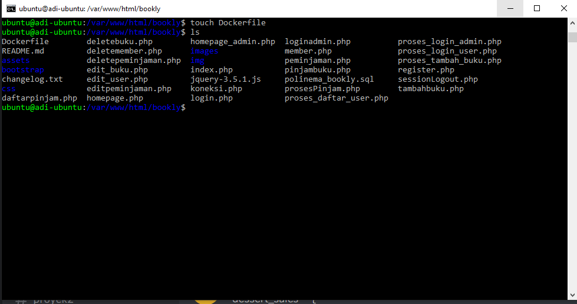

# 13 - Kuis 2 Build Image Docker dan Push Docker Hub

## Tujuan Pembelajaran

1. Agar dapat menjalankan build images repository kemudian melakukan push repository ke Docker Hub.

## Hasil Praktikum

1. Dikarenakan project UTS saya kemarin hilang maka saya membuat baru lagi pertama melakukan git clone project saya kedalam ubuntu.

2. Kemudian Ls untuk cek project sudah ada di direktori ubuntu.

3. Edit koneksi.php agar tersambung ke dalam mysql.

4. Project berhasil dijalankan di ip public ubuntu.

5. Kemudian pada direktori project bookly buat file Dockerfile.

6. Sudo nano dockerfile edit sesuai project yang di gunakan di sini menggunakan apache dan mysql.

7. Kemudian lakukan build image project bookly tersebut.

8. Cek image pastikan build berhasil masuk images.

9. Lalu lakukan docker login kemudian push project bookly ke docker hub seperto berikut ini :

10. Kunjungi website docker hub kemudian cek bagian repository pastikan project kita sudah push ke docker hub seperti dibawah ini.

