# 14 - Jobsheet 13 – Serverless

## Tujuan Pembelajaran

1. Agar dapat menerapkan severless pada oracle cloud

## Hasil Praktikum

## Hello World Function

1. Masuk ke akun https://cloud.oracle.com dan navigasi ke menu Developer Services -> Applications kemudian Tekan tombol Create Application.

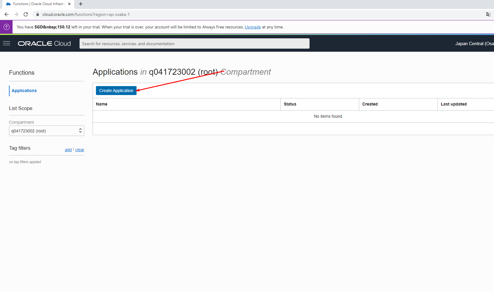

2. Lengkapi informasi form Name dengan hello-app. Lengkapi juga VCN dan subnet yang dibutuhkan

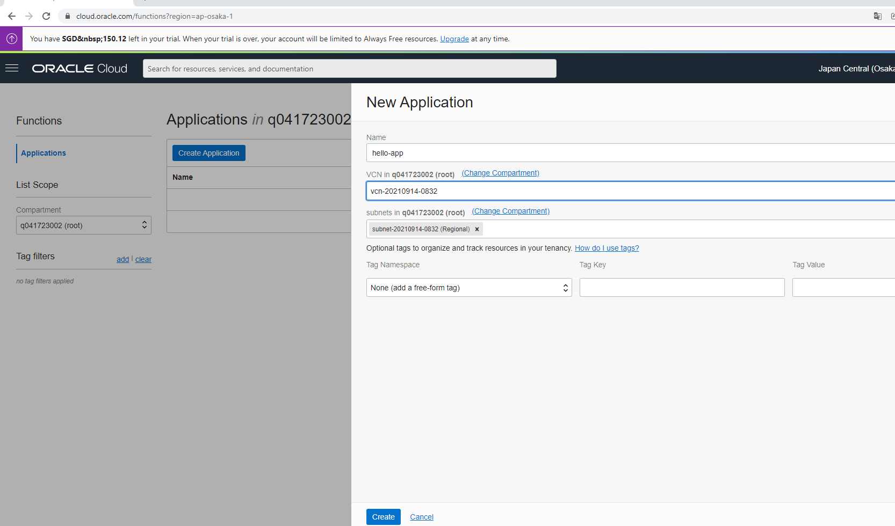

3. Aktifkan Cloud Shell dengan menekan tombol Launch Cloud Shell. Tunggu proses provisioning cloud shell selesai. Anda akan mendapatkan sebuah terminal built-in yang  dapat digunakan untuk melakukan proses deployment.

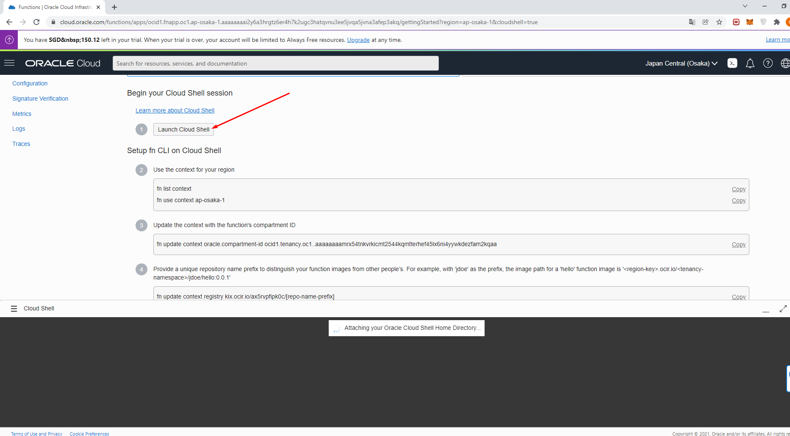

4. Ikuti langkah-langkah dengan melakukan copy perintah kemudian tempelkan ke dalam terminal Cloud Shell.

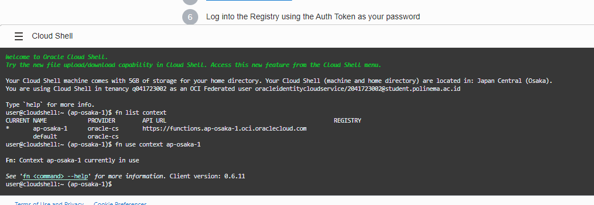
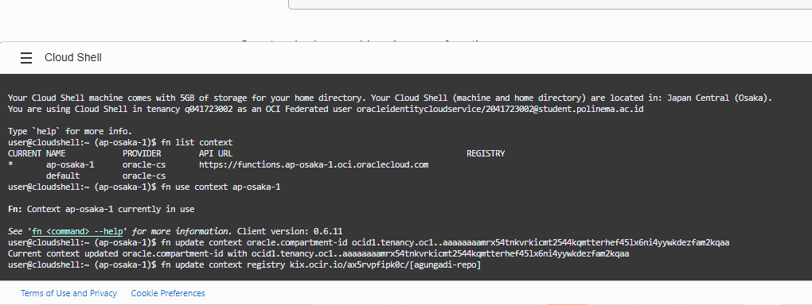

5. Pada langkah ke 5, dilakukan proses pembuatan token untuk autentikasi. Tekan tombol Generate Token dan lengkapi form Description dengan nama yang relevan (contoh: faas). Simpan token tersebut.

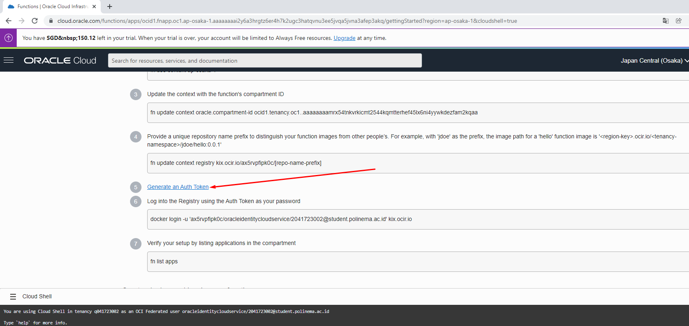
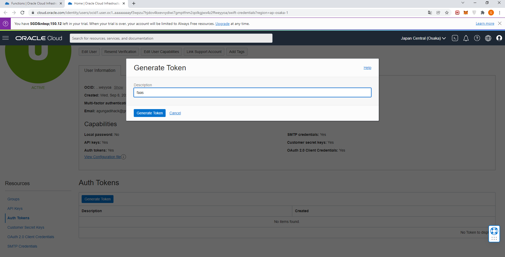

6. Token yang didapatkan, akan digunakan untuk autentikasi pada langkah ke 6. Tempel token yang didapatkan dan pastikan proses login telah berhasil

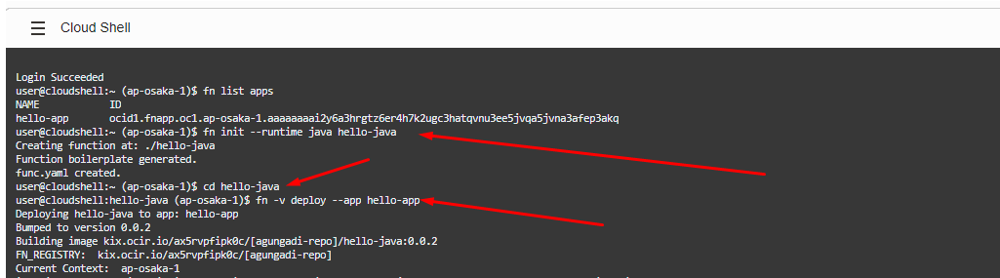

7. Ikuti langkah-langkah sampai anda dapat menampilkan tampilan “Hello, world!”.

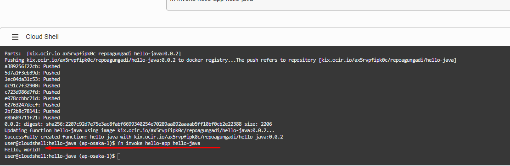

8. Navigasi menu ke Functions di sebelah kiri bawah. Anda akan mendapatkan detil fungsi yang tersedia. Pada halaman ini terdapat informasi mengenai Functions, serta invoke endpoint yang dapat digunakan untuk pemanggilan function.

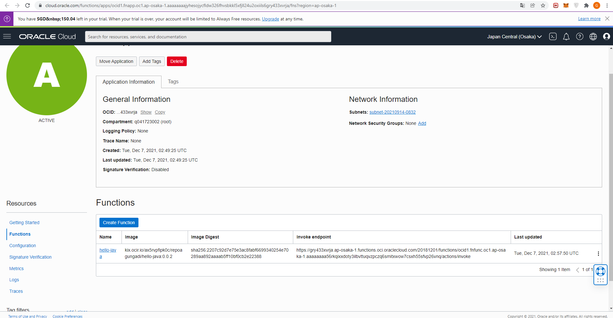

9. Memanggil Function menggunakan fn, Function pada FaaS dapat juga dipanggil menggunakan oci-cli sebagai berikut :

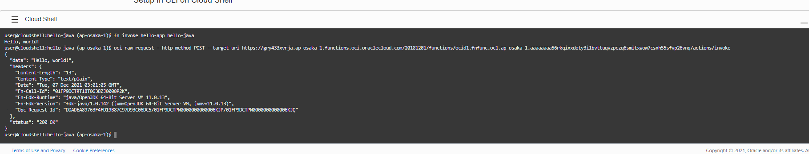

## Tugas

1. Saya memilih sample OCI-Vault-get-Secret-Python https://github.com/oracle/oracle-functions-samples/tree/master/samples/oci-vault-get-secret-python yang bergungsi untuk mendapatkan secret vault memlalui cloud server mennggunakan python.

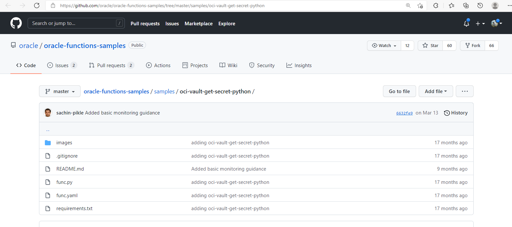

2. Pertama saya membuat dynamic-group kemudian isikan rule dengan ocid compartement sebagai berikut :

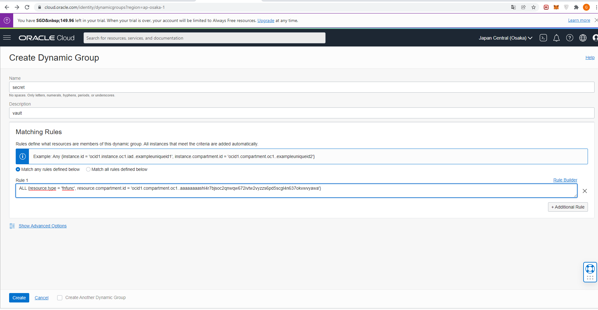

3. Kemudian membuat policy untuk mengizinkan dynamic group untuk menggunakan secret-family.

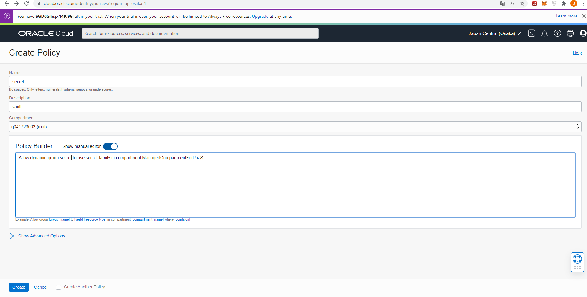

4. Selanjutnya membuat secret vault.

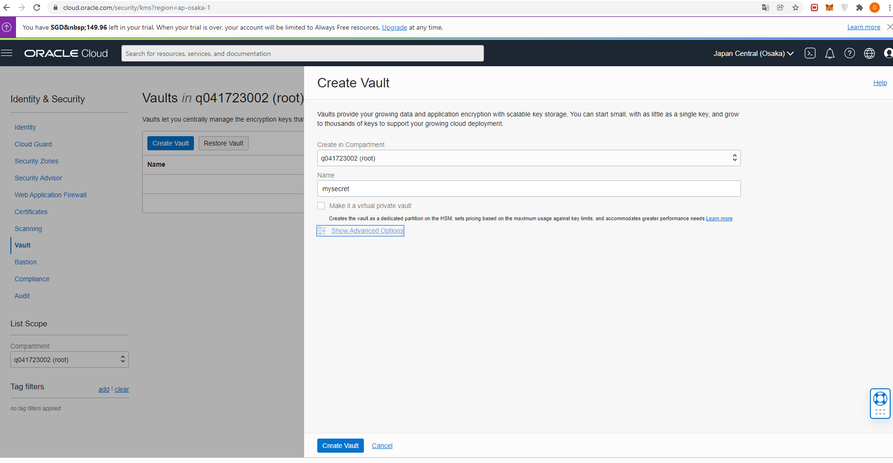
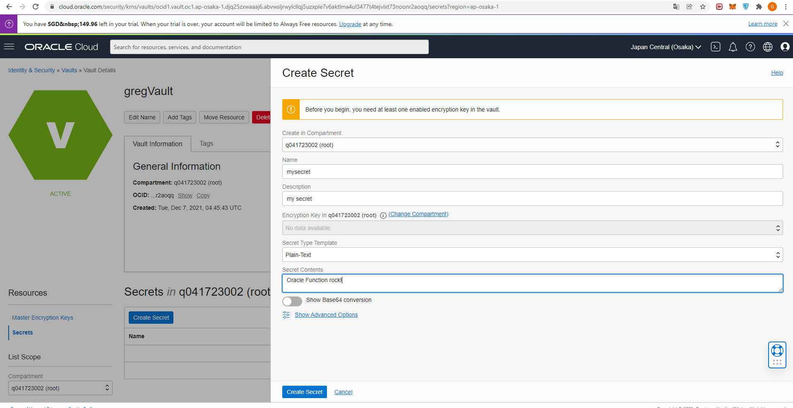

5. Membuat functions application baru dengan nama vault-secret.

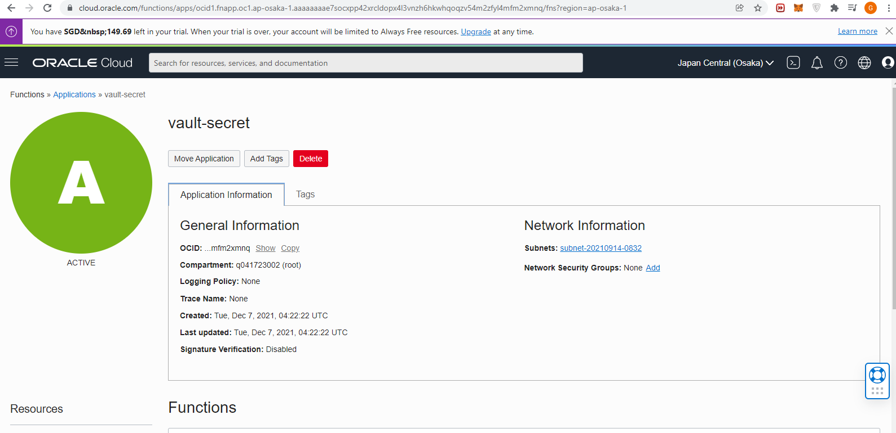

6. Jalankan perintah getting start pada cloud shell.

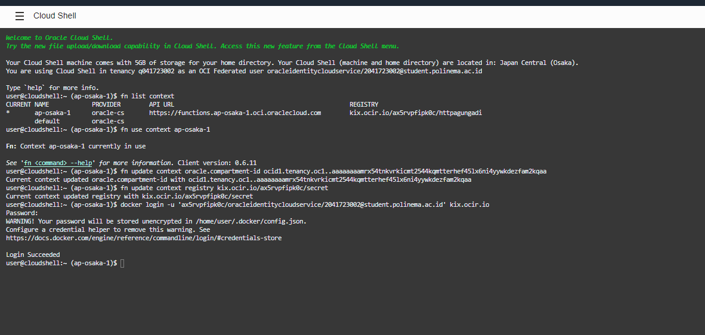

7. Lakukan deploy python pada cloud shell.

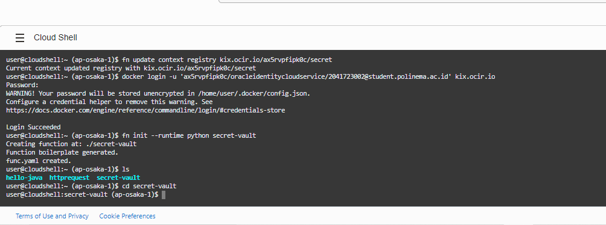

8. Edit function code pada python sesuaikan dengan sample pada github.

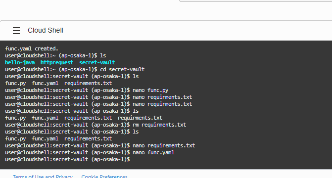

9. Invoke the function untuk mendapatkan secret type berupa text :

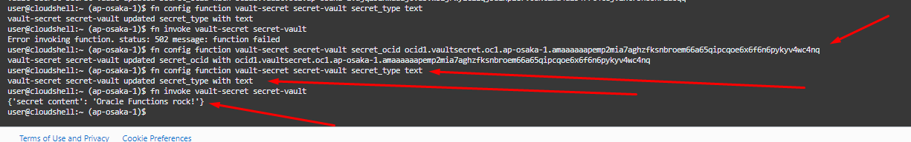

10. Invoke the function untuk mendapatkan secret type berupa binary :

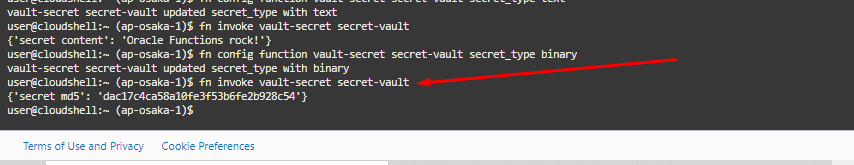

