# 15 - Jobsheet 15 – Autoscalling

# Tujuan Pembelajaran

1. Agar dapat konfigurasi Autoscaling pada oracle cloud

## Hasil Praktikum

### Membuat Konfigurasi Instance

1. Pada halaman instance configurations klik create instance configuration

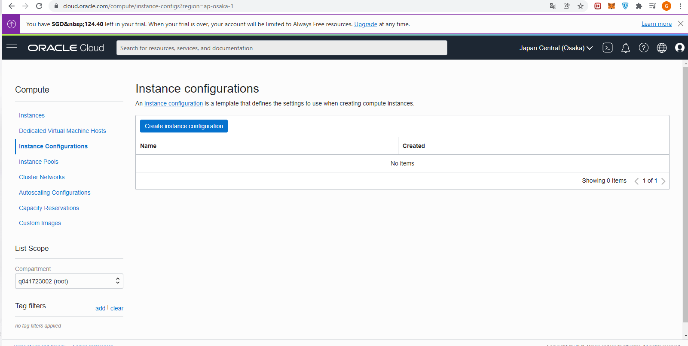

2. pilih compartement dan isi nama instance-configuration, kemudian clik create instance configuration.

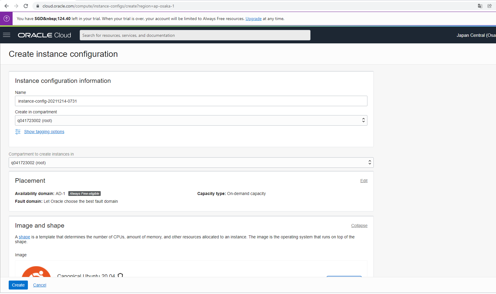

3. Instance config berhasil dibuat.

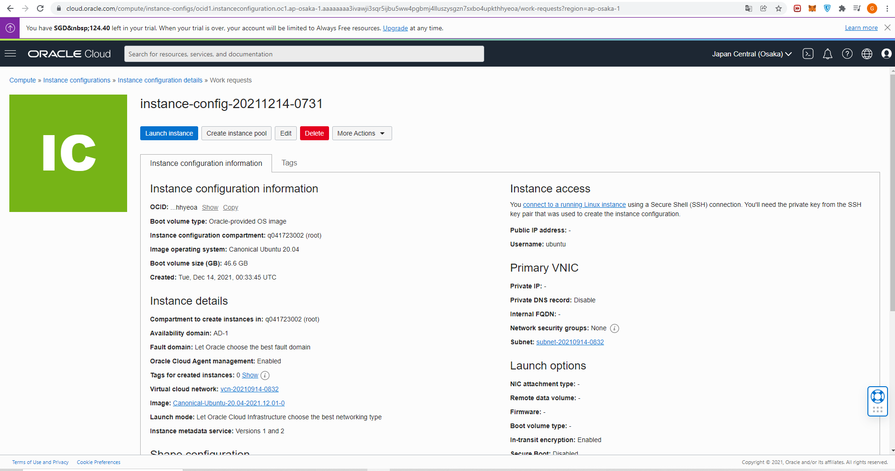

### Membuat Instance Pool

1. Klick create instance pool kemudian isi nama, compartement dan instance config.

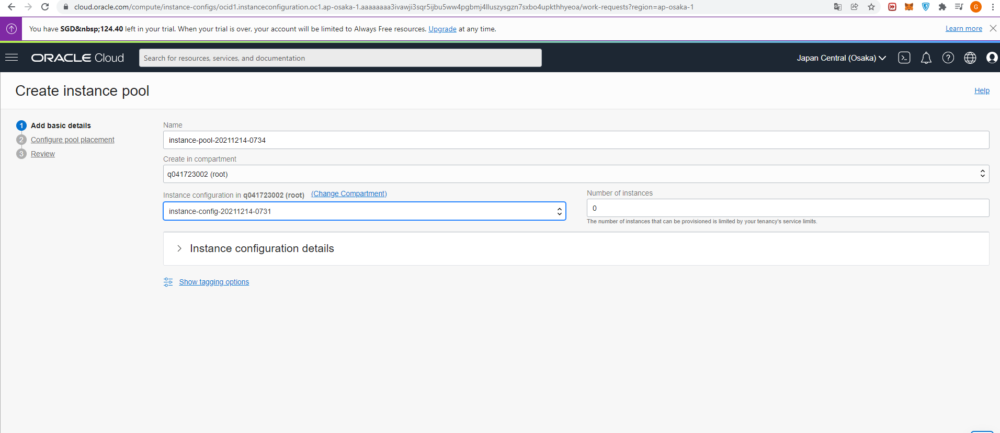

2. Pilih avaibility domains, VCN, Fault-domain, dan subnet kemudian next.

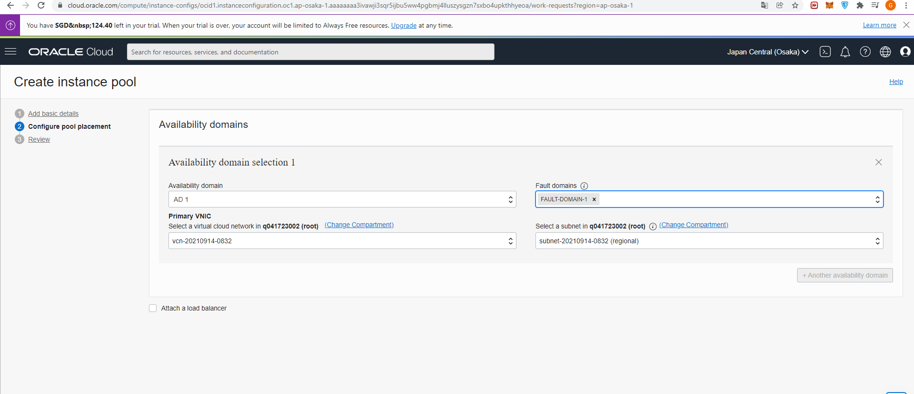

3. Klik create

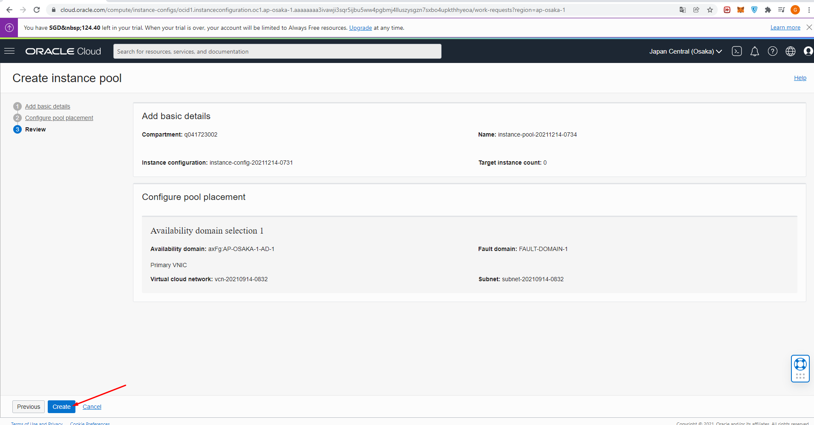

4. Instance pool berhasil dibuat

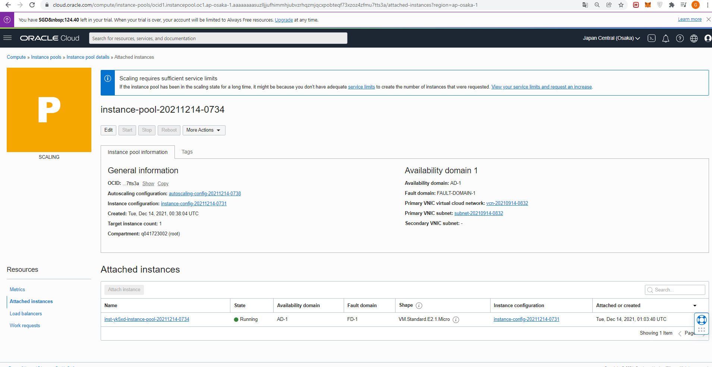

### Membuat Konfigurasi Autoscalling

1. Klik menu More Actions dan pilih Create Autoscaling Configuration.

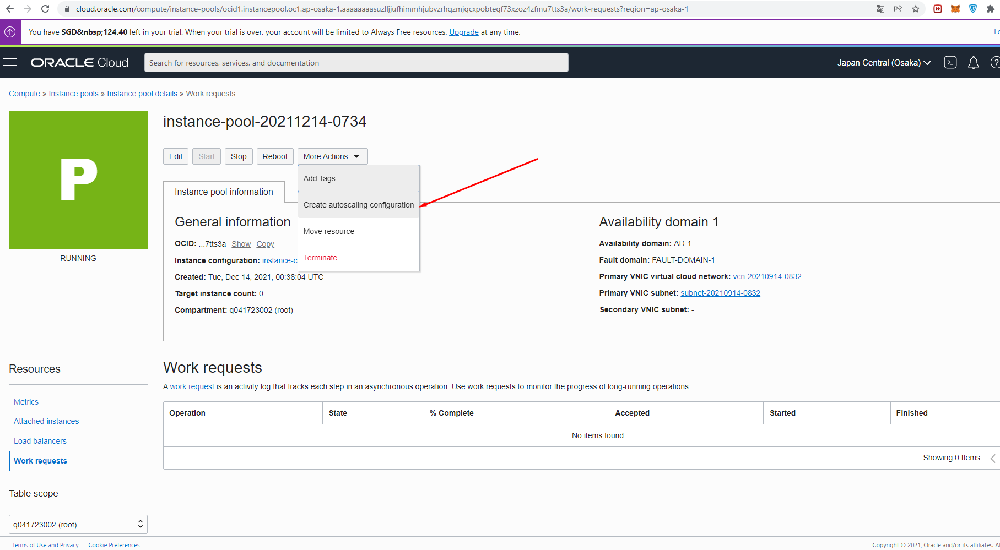

2. isi nama dan pilih compartment,

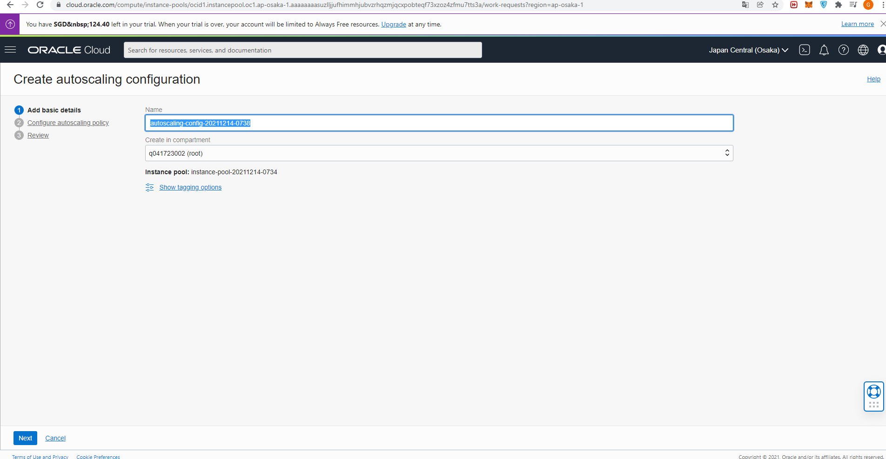

3. konfigurasi metric-based autoscaling

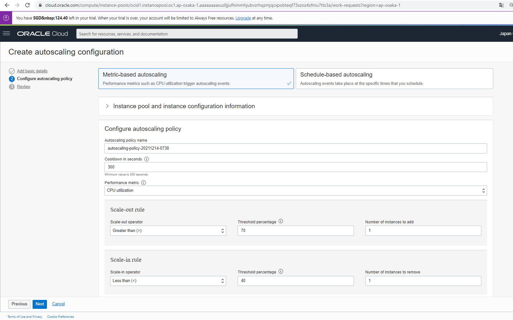

4. konfigurasi schedule-based autoscaling

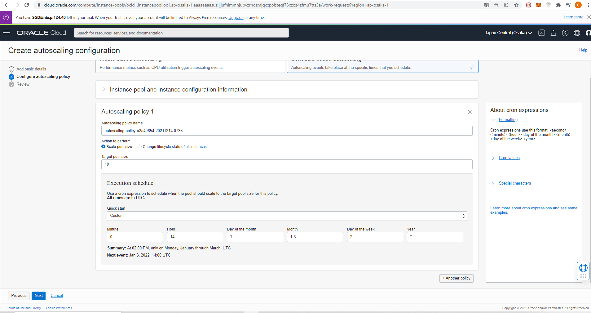

5. Klik create

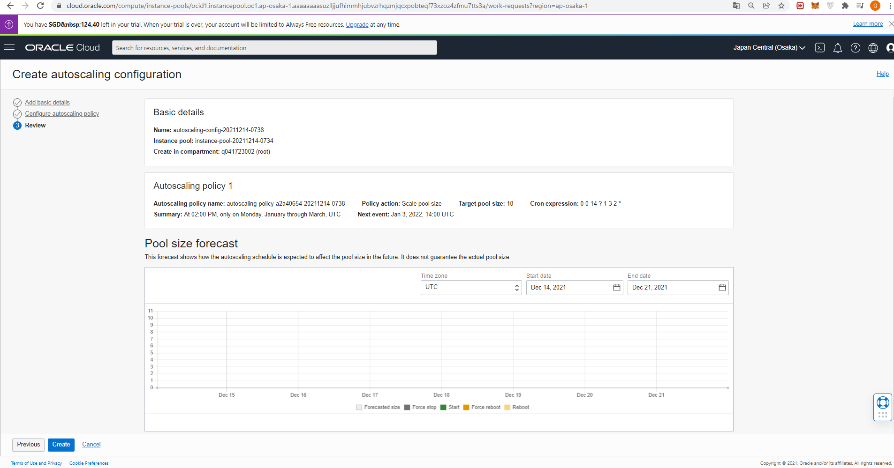

6. Autoscaling berhasil dibuat.

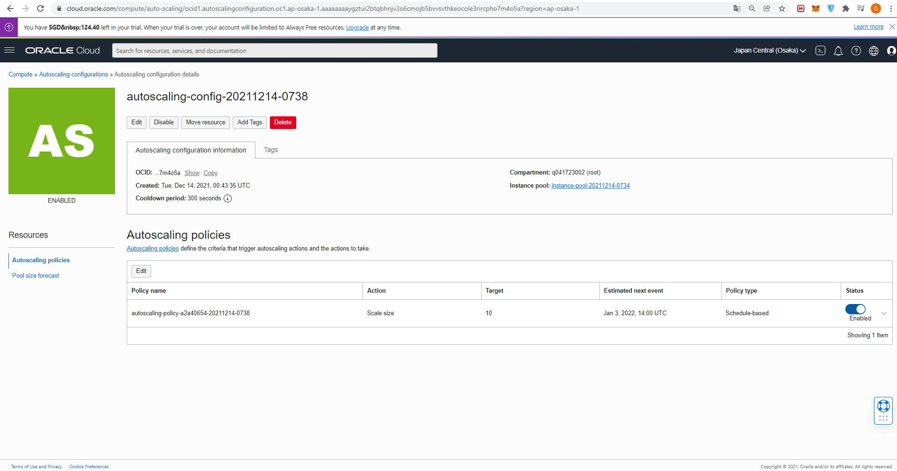

### Jelaskan Apa kaitan Autoscalling dengan Availability?

Dengan menggunakan autoscalling bisa mendeteksi avaiblability instance server yang tidak normal/overload agar dapat membantu memastikan bahwa server  selalu memiliki jumlah kapasitas yang tepat untuk menangani permintaan lalu lintas saat ini, menghentikan server dan meluncurkan ulang server sehingga menjaga ketersediaan layanan server terus berjalan.